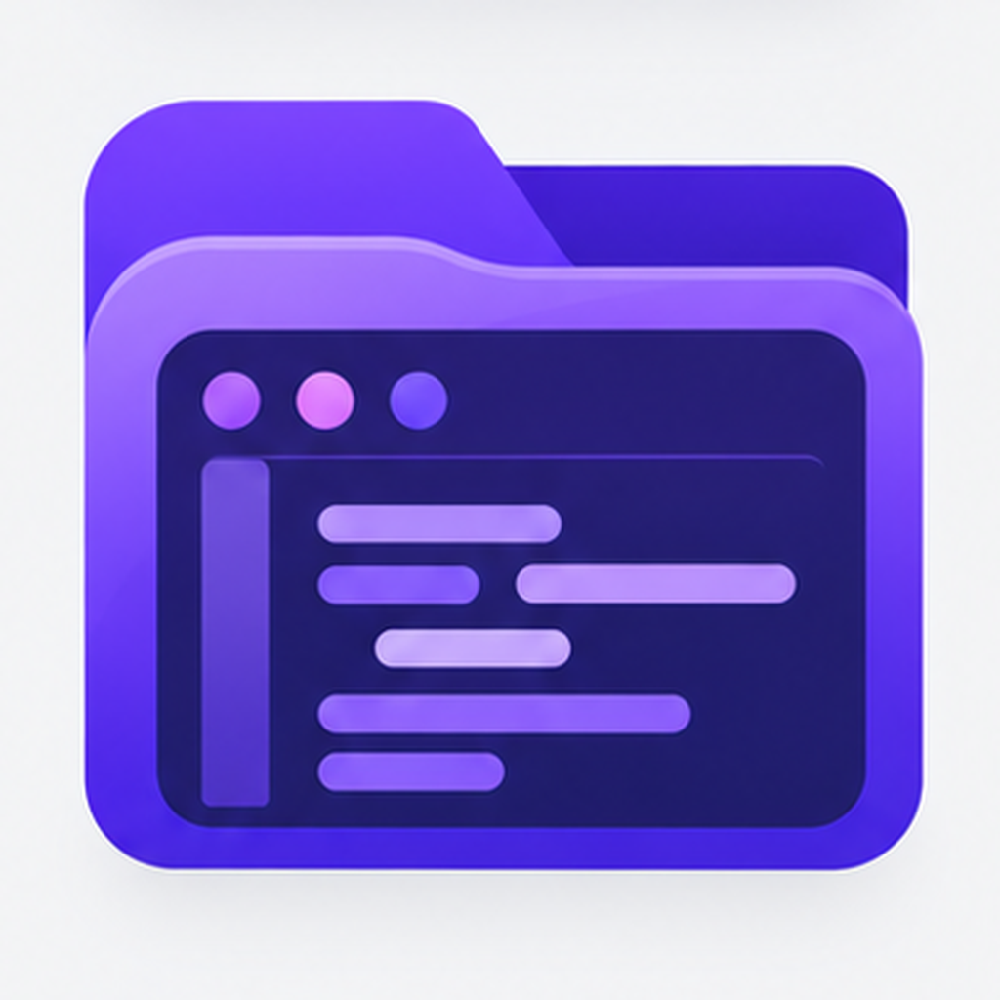
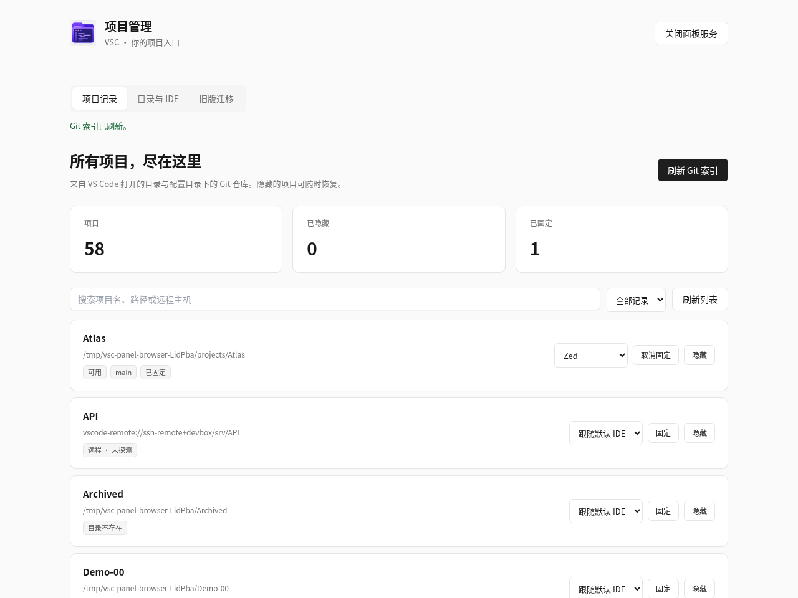

# VSC · Alfred 项目入口



搜索 **VS Code 最近打开的目录 ∪ 配置根目录下的 Git 仓库**，用 VS Code、Zed、Trae 或 Cursor 打开。只收录本地目录和远程目录，不收录文件或 `.code-workspace` 文件。

V3 使用 Go 原生二进制。安装工作流后，**无需安装 Python、Node.js、Go 或 sqlite3**。SQLite 已编入程序；读取分支也不调用 Git 命令。打开项目仍需安装对应 IDE，SSH / 容器连接由 IDE 自己处理。

## 安装与使用

本次构建的安装包需要 macOS 13+、Alfred 5 和 Powerpack。导入 `build/vsc.alfredworkflow`，在工作流配置中填写 Git 项目根目录，例如 `~/Code,~/Projects`。安装包包含 Apple Silicon / Intel 通用二进制，不需要选择芯片架构。

需要隔离开发验收时，可导入测试包 `build/vsc-dev.alfredworkflow`：关键词为 `vscd` / `vscdli`，偏好和缓存存放在 `/tmp/vsc-dev-v3`，可与旧版共存。测试包默认与正式版使用相同的项目来源配置，但不会迁移正式版隐藏记录。

正式包的 Bundle ID 固定为 **`com.harvey.alfredapp.vsc.v3`**。已经使用这个 ID 安装并完成迁移的用户，之后直接导入新的 `vsc.alfredworkflow` 更新即可；无需再改 ID、复制数据或重跑迁移。保留原工作流后，可继续用 `vsco` / `vscoli` 访问旧版。

| 工作流 | Bundle ID | 入口 |
| --- | --- | --- |
| V3 正式版 | `com.harvey.alfredapp.vsc.v3` | `vsc` / `vscli`，默认 ⌘⇧V |
| V3 开发版 | `com.harvey.alfredapp.vsc.v3.dev` | `vscd` / `vscdli`，默认不绑定热键 |
| 保留的旧版 | `com.harvey.alfredapp.vsc` | 用户改为 `vsco` / `vscoli` |

正式版默认数据目录为 `~/Library/Application Support/Alfred/Workflow Data/com.harvey.alfredapp.vsc.v3`，与旧版及开发版隔离。安装包不包含用户配置、偏好或迁移记录，不覆盖这些数据。

| 操作 | 行为 |
| --- | --- |
| Command + Shift + V | 唤醒 VSC 项目搜索，继续输入筛选项目 |
| `vsc 关键词` | 按名称、路径、远程主机名模糊搜索，支持中文和多个词 |
| `vsc d 关键词` / `vsc r 关键词` | 只看本地目录 / 远程目录 |
| `vsc /` | 浏览配置根目录；多个根目录先选择，再用 Tab 逐层进入 |
| Enter | 用默认 IDE 打开，默认是 VS Code |
| Shift + Enter | 新窗口打开 |
| Cmd + Enter | 选择其他 IDE；在 IDE 列表中 Cmd + Enter 可记住此项目的选择 |
| Ctrl + Enter | 隐藏项目，不删除文件、不修改 VS Code 历史 |
| Alt + Enter | 固定 / 取消固定，同等匹配程度下优先排列 |
| `vscli` | 打开记录管理面板、刷新索引、恢复隐藏、诊断 |

快捷键可在工作流的 Hotkey 节点修改；若 Alfred 导入后未启用或快捷键已被占用，可在该节点重新录入。默认热键仅正式包提供，开发包不会抢占。

列表默认返回前 50 项。名称匹配优先，同等匹配时固定项目优先，之后沿用 VS Code 历史顺序。目录浏览可以打开非 Git 子目录，但不会自行把它加入项目历史。

## 数据与性能

- 每次查询只读 VS Code SQLite 中的 `recently.opened`，兼容 `history.recentlyOpenedPathsList`，支持 WAL。优先探测应用共享存储，再探测 `Code/User/globalStorage/state.vscdb`。可以指定数据库路径。
- 历史内容变化时更新可丢弃的规范化快照；没有第二份独立维护的最近项目清单。不修改 VS Code 数据库。
- Git 仓库递归发现放在独立后台进程中，默认五分钟刷新；首次发现期间 Alfred 自动重新查询。扫描不跟随子目录符号链接，跳过隐藏目录和常见依赖、构建目录，默认深度 8，上限 20 秒 / 10 万个目录。手动刷新用 `vscli`。
- 本地可见结果每次读取当前 HEAD，支持普通仓库、worktree、仓库子目录和 detached HEAD。只读前 50 个匹配结果的分支，使用四个工作线程和 30ms 读取预算。慢挂载超时会显示提示，不使用旧分支冒充最新分支。
- **远程目录不查询、不展示分支，也不建立 SSH 或容器连接。** 原始远程 URI 交给 IDE；容器默认仅允许 VS Code。Zed 只转换明确的 SSH 主机地址；编码或不支持的远程类型会给出提示。
- 数据库被锁、短暂缺失或内容损坏时退回同一来源的上次快照；数据库返回空历史时会立即清空历史来源。仓库扫描不完整时保留上次结果，避免临时挂载故障导致列表消失。
- 隐藏、固定、项目 IDE 偏好独立持久化，文件锁防止并发丢失更新，原子替换防止半写入。

默认用户数据：Alfred 提供的 `alfred_workflow_data`；独立 CLI 使用系统配置目录下的 `alfred-vsc`。`preferences.json` 是用户偏好，`cache/` 是可重建缓存。搜索不进行网络请求，也不依赖常驻服务。管理面板仅在打开时监听本机回环地址，20 分钟无操作自动退出。

## 记录管理面板



输入 `vscli` → **打开记录管理面板**；开发包使用 `vscdli`。也可以在工作流目录运行 `./vsc manage`。页面和本地 HTTP 服务都编入同一个二进制，不需要额外安装环境。

- **项目记录**：搜索、分页，筛选隐藏 / 固定 / 本地 / 远程；逐条隐藏或恢复、固定、设置项目默认 IDE。本地每页即时读取分支与目录状态，明确提示目录不存在、权限不足、路径不是目录或读取超时。
- **目录与 IDE**：每行一个 Git 扫描根目录、默认 IDE、各 IDE 的 CLI 路径。保存后下次 Alfred 查询生效；改根目录后点击「刷新 Git 索引」。隐藏不删除目录，也不修改 VS Code 的历史。
- **旧版迁移**：选择已保存的迁移来源或输入旧数据路径，先预览，再执行补迁移；逐条列出未迁移项及处理方法。旧版本留下的首次迁移报告会明确标为历史快照，重新预览可看到当前范围。

面板保存的根目录 / IDE 设置放在 `config.json` 的 `managed` 中，**优先于 Alfred 变量和顶层配置**，避免 Alfred 默认值覆盖已保存的设置。点击「恢复使用 Alfred / 高级配置」移除这些覆盖，保留其他高级配置与项目偏好。面板只管理当前来源中的目录；不再属于当前来源的偏好保留在文件中，供目录以后重新出现时使用。

面板仅监听 `127.0.0.1` 随机端口，使用随机会话令牌、来源校验和浏览器隔离策略。关闭浏览器标签不会立即停止服务；可点击「关闭面板服务」，或等待 20 分钟无操作自动退出。可用 `./vsc manage --serve` 在终端启动并手动打开打印的网址；该网址包含本次会话凭证，请勿分享。

## 配置

Alfred 的工作流配置提供根目录、默认 IDE 和四个 CLI 路径。CLI 路径只填写可执行文件，不填写参数或 shell 命令。程序自动发现 PATH 及 macOS 常用应用安装位置。

| 环境变量 | 用途 / 默认值 |
| --- | --- |
| `VSC_DIRECTORIES` | 根目录，逗号、换行或 JSON 字符串数组；有逗号的路径使用 JSON |
| `VSC_DEFAULT_EDITOR` | `vscode`、`zed`、`trae`、`cursor`；默认 `vscode` |
| `VSC_EDITOR_VSCODE` / `VSC_EDITOR_ZED` / `VSC_EDITOR_TRAE` / `VSC_EDITOR_CURSOR` | 可选 CLI 完整路径 |
| `VSC_IDE_PATH` | VS Code 用户数据目录，macOS 默认为 `~/Library/Application Support/Code` |
| `VSC_DB_PATH` | 精确指定 `state.vscdb`；优先于自动探测 |
| `VSC_LIMIT` | 返回数量，默认 50，范围 1–200 |
| `VSC_SCAN_DEPTH` | 扫描深度，默认 8，范围 0–32 |
| `VSC_REFRESH_SECONDS` | 仓库刷新间隔，默认 300 |
| `VSC_DATA_DIR` / `VSC_CACHE_DIR` | 覆盖偏好 / 缓存目录 |
| `VSC_NO_BACKGROUND=1` | 禁止后台扫描，适合可重复测试 |
| `VSC_LEGACY_CACHE` | 迁移命令的默认源缓存路径；查询不自动迁移 |

`vsc config-init` 生成不覆盖已有文件的 `config.json`；通常环境变量优先于配置文件；面板保存的 `managed` 根目录和 IDE 设置优先级最高。配置示例：

```json
{
  "roots": ["~/Code", "~/Projects"],
  "editor": "vscode",
  "editors": {"zed": "/usr/local/bin/zed"},
  "limit": 50,
  "scan_depth": 8,
  "refresh_seconds": 300
}
```

## 构建与验收

开发需要 Go 1.26+、Node.js 22+、pnpm 11.19.0（React 页面构建）、Python 3.9+（构建和验收脚本），验收脚本还需 Git。**这些都不是成品运行依赖。** Linux amd64 成品是静态链接 ELF；macOS 是单个 universal Mach-O，使用系统提供的库，不需要额外运行时。不同操作系统不能共用同一个二进制。

```sh
pnpm --dir web install --frozen-lockfile
pnpm --dir web run build                  # 必须先生成 Go embed 使用的页面
go test -race ./...
go vet ./...
go mod verify
python3 scripts/build_workflow.py             # Linux + macOS 双架构 + 通用工作流
python3 tests/e2e/acceptance.py --benchmark     # Linux 实际二进制验收与性能数据
python3 tests/e2e/panel_acceptance.py           # 原生管理服务、偏好、配置和迁移集成验收
python3 scripts/verify_package.py             # ZIP、权限、Alfred 接线、Mach-O slices
python3 scripts/build_workflow.py --target macos --skip-build --dev
```

管理页面使用 React + TypeScript、Rspack 和 shadcn UI 组件，源码位于 `web/`。`web/package.json` 的 `packageManager` 固定 pnpm 版本，依赖由 `web/pnpm-lock.yaml` 锁定。构建脚本会先执行 `pnpm install --frozen-lockfile` 与页面构建，再编译 Go；产物 `internal/workflow/panel/dist/` 不入库。`--skip-build` 只打包已有二进制，不需要 Node。

可用 `--go /absolute/path/to/go` 指定编译器。`--target linux` 只构建 Linux，`--target macos` 只构建 macOS。二进制和安装包在 `build/`，校验和在 `build/SHA256SUMS`。测试开发包可用 `python3 scripts/dev_install.py --open` 在 macOS 导入。

`tests/e2e/panel_browser_acceptance.cjs` 使用 Playwright + Chromium 点击真实页面，验证搜索、隐藏、IDE 设置、迁移及移动布局；它仅用于开发验收，不打入工作流。报告存于 `build/` 和 CI artifact，重跑步骤见 [验收说明](docs/VALIDATION.zh-CN.md)。

Linux 验收覆盖真实 SQLite / WAL、真实 Git 仓库与 worktree、分支切换、并发偏好写入、后台索引，以及替身 IDE 进程收到的完整参数。它不能代替 Alfred UI、macOS 应用启动或真实远程连接测试。具体待测项见 [macOS 验收清单](docs/MACOS-ACCEPTANCE.zh-CN.md)，设计与选型见 [技术设计](docs/ARCHITECTURE.zh-CN.md)。

开发代码按职责组织，目录说明见 [技术设计](docs/ARCHITECTURE.zh-CN.md)。Go 使用 `gofmt`，Python 使用 Ruff 0.11.13，面板 TS / TSX / CSS 与浏览器验收脚本使用 Prettier 3.5.3；仓库提供 `.editorconfig`、`ruff.toml`、`.prettierrc.json`。这些格式化工具仅供开发使用，不是成品运行依赖：

```sh
gofmt -w cmd internal
uvx --from ruff==0.11.13 ruff format scripts tests/e2e
pnpm dlx prettier@3.5.3 --write 'web/src/**/*.{ts,tsx,css}' 'web/*.{json,cjs,mjs,html}' tests/e2e/panel_browser_acceptance.cjs
```

## 从 V2 升级

先安装隔离测试包，确认后再替换正式版。使用随包提供的迁移脚本：

```sh
./scripts/migrate-v2.sh --source "/旧版工作流目录" --data-dir "/tmp/vsc-dev-v3" --dry-run
./scripts/migrate-v2.sh --source "/旧版工作流目录" --data-dir "/tmp/vsc-dev-v3" --apply
```

它会先备份，再迁移新版来源范围内目录的隐藏状态与旧使用顺序。范围外记录不导入，输出 `unmigrated` 列表和逐条补迁移方法；先用 VS Code 打开这些目录或配置 Git 根目录，再重跑即可补齐。重复执行保留迁移后用户的取消隐藏操作。普通查询不会偷偷执行迁移或扫描旧数据。

终端不会自动继承 Alfred 配置；建议从面板配置根目录并执行迁移，或先在管理菜单生成高级配置，确认迁移目标目录和根目录，详见 [迁移步骤、未迁移列表与恢复方法](docs/MIGRATION.zh-CN.md)。原文件、用户配置和未知字段完整备份，旧分支缓存与文件条目不用于新版搜索。

旧 `VSC_OPEN_DEFAULT` 仅作为默认编辑器可执行路径兼容；旧 `VSC_OPEN_WITH_CMD` 改为 IDE 选择菜单，请使用 `VSC_EDITOR_*` 配置。

MIT License.
